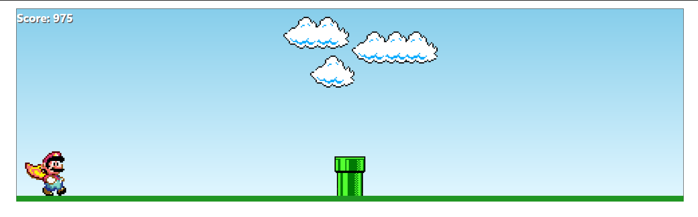
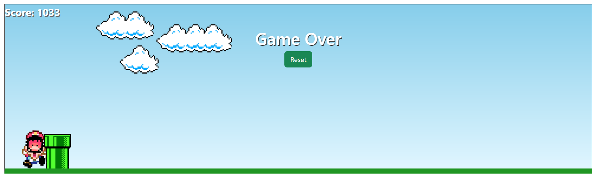

## Informações

Projeto feito a partir de um tutorial do youtube
https://www.youtube.com/watch?v=r9buAwVBDhA&list=WL&index=176&t=1350s&ab_channel=ManualdoDev

Com esse tutorial consegui ampliar meus conhecimentos em JS.
(Fiz a implementação de um botão de reiniciar e de uma tela de gameover)

## Tecnologias

Esse projeto foi desenvolvido com as seguintes tecnologias:

- JavaScript
- Html
- Css
- Bootstrap

## Screenshots

Tela de inicio
<h1 align="center">
    
</h1>

Tela Game Over 
<h1 align="center">
    
</h1>
